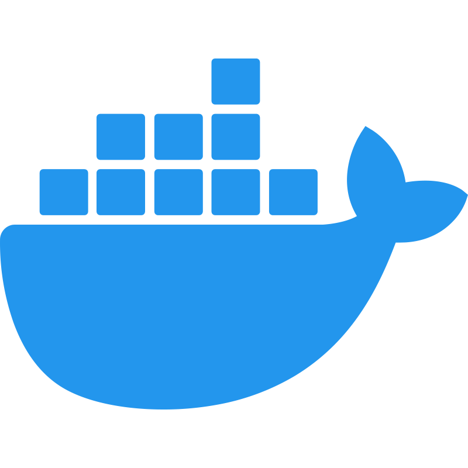

Driven by a love for building full-stack applications, I'm a .NET backend developer with a burning desire to learn and grow. While I'm expanding my skills with React, my heart lies in the exciting world of backend development using .NET. Here, I relish the challenge of crafting robust experiences, one line of code at a time. I'm eager to dive deeper into this intricate world and contribute to building amazing applications!

---
### My Skills

---

